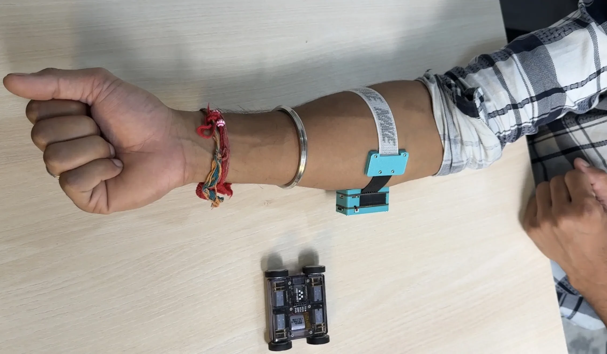
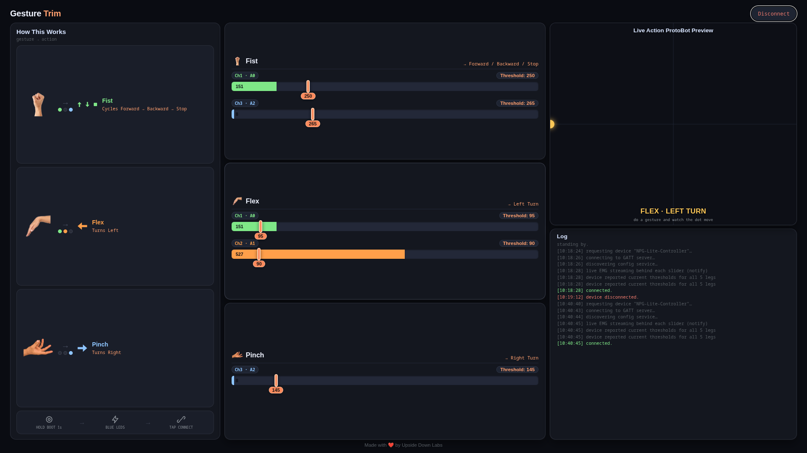

# EMG Armband Gesture Control for microbots.io ProtoBot

This folder contains firmware for a **3-channel EMG (muscle) gesture controller** that drives a **stock, unmodified microbots.io ProtoBot** over Bluetooth Low Energy (BLE), plus a companion **Web Bluetooth config page** for live threshold tuning.

The armband uses **three dry EMG electrodes** (no gel, no prep) built into a wearable band. The board also carries an on-board accelerometer, but **this project does not use it** - all gestures are recognized purely from the three EMG channels.

## 1. How It Works

ProtoBot ships running the **CodeCell-MicroLink** library, which exposes a BLE GATT "joystick" characteristic that the official MicroLink phone app normally writes to in order to drive it.

This firmware turns the armband's controller board into a **BLE client** that connects directly to that same characteristic and writes joystick values itself - so from ProtoBot's point of view, it looks exactly like the MicroLink app is driving it.

**No changes to the ProtoBot's firmware are required.** The protocol was reverse-derived from the public [CodeCell-MicroLink source](https://github.com/microbotsio/CodeCell-MicroLink):

| Item | Value |
|---|---|
| Service UUID | `12345678-1234-1234-1234-123456789012` |
| Joystick characteristic (write) | `abcd1234-abcd-1234-abcd-123456789012` |
| Settings characteristic (write) | `dcba4330-dcba-4321-dcba-432123456789` |
| Value format | 2 bytes `[X, Y]`, range 0–200, 100 = center/neutral |
| Advertised name filter | `protobot` |

Alongside this, the board runs a **second BLE role** - a small GATT *server* ("config service") that a companion web page (Web Bluetooth) can connect to, in order to read live EMG envelopes and set gesture thresholds on the fly. The two roles don't run at the same time (see [Config Mode](#5-config-mode--live-threshold-tuning) below) - the radio is dedicated to whichever job is active.

## 2. Hardware Overview

### Armband (Signal Acquisition)

* ESP32-based controller board worn as an armband
* **3 dry EMG electrodes** (no gel required) - used as the only input for gesture control
* On-board accelerometer - **present but unused** in this project
* Sampling rate: **512 Hz**
* On-board features:
  * NeoPixel LEDs (6 pixels) - connection/battery status
  * BLE connectivity, acting as **both a client** (to ProtoBot) **and a peripheral/server** (to the config web page)
  * BOOT button - hold 1s to toggle Config Mode

**Armband wear position:**



### Controlled Device

* **Stock microbots.io ProtoBot** - no firmware modification needed

## 3. EMG Channel Assignment

| Channel | Pin | Role |
|---|---|---|
| Ch1 | A0 | "Fist" leg - combines with Ch3 to cycle Forward → Backward → Stop; also gates the Left-turn gesture |
| Ch2 | A1 | "Flex" leg - combines with Ch1 to trigger Left turn |
| Ch3 | A2 | "Fist" leg (combines with Ch1) and "Pinch" leg (alone) - triggers Right turn |

## 4. Gestures & Actions

| Gesture | Channels involved | Action |
|---|---|---|
| **Fist** | Ch1 (A0) + Ch3 (A2) together | Edge-triggered cycle: Stop → Forward → Backward → Stop → … |
| **Flex** | Ch1 (A0) + Ch2 (A1) together | Turn Left (overlay - resumes previous Fwd/Back/Stop state on release) |
| **Pinch** | Ch3 (A2) alone | Turn Right (overlay - resumes previous Fwd/Back/Stop state on release) |

Priority order: **Fist (Fwd/Back/Stop) > Flex (Left) > Pinch (Right)**. A Fist gesture always takes priority even though it also technically satisfies the Pinch channel condition, so turning gestures never interrupt a Fwd/Back/Stop cycle.

## 5. Signal Processing Pipeline (per EMG channel)

* 50 Hz Notch filter (power-line noise removal)
* High-pass filter (70 Hz cutoff)
* Rectification
* Envelope detection (16-sample moving average)

The resulting envelope value is compared against its gesture's threshold to detect a contraction.

## 6. Web UI - Gesture Trim (Live Threshold Tuning)

A companion single-page **Web Bluetooth** app (`index.html`) lets you view live EMG envelopes and tune each gesture's threshold without reflashing firmware.

**Requirements:** Chrome or Edge, desktop or Android (Safari/Firefox do not support Web Bluetooth).

**How to enter Config Mode:**

1. Hold the armband's **BOOT button for 1 second** (or send the serial `config` command)
2. All NeoPixel LEDs turn **blue** - this pauses the ProtoBot BLE link and frees the radio for the config page
3. Open `index.html` in a supported browser and click **Connect**
4. Sliders show each gesture leg's live envelope fill (behind the slider) plus its current threshold - drag to adjust, changes autosave to the board's flash (NVS) after a short debounce
5. A live joystick preview and log panel on the right mirror exactly what ProtoBot would receive
6. Hold **BOOT for 1s again** to exit Config Mode and resume driving ProtoBot

**UI:**



### Config BLE Protocol

| Item | UUID |
|---|---|
| Config service | `d1b3d900-0000-1000-8000-00805f9b34fb` |
| Threshold write (5 bytes: `[legId][uint32 LE value]`) | `d1b3d901-0000-1000-8000-00805f9b34fb` |
| Threshold read/notify (20 bytes: 5 × uint32 LE) | `d1b3d902-0000-1000-8000-00805f9b34fb` |
| Live EMG read/notify (6 bytes: 3 × uint16 LE, ~51 Hz) | `d1b3d903-0000-1000-8000-00805f9b34fb` |

| Leg ID | Name | Gesture | Channel |
|---|---|---|---|
| 0 | `fbsCh1` | Fist | Ch1 (A0) |
| 1 | `fbsCh3` | Fist | Ch3 (A2) |
| 2 | `leftCh1` | Flex | Ch1 (A0) |
| 3 | `leftCh2` | Flex | Ch2 (A1) |
| 4 | `rightCh3` | Pinch | Ch3 (A2) |

Thresholds set from the web UI are written straight to NVS (`Preferences`) - the same storage the serial `set` commands use, so both control paths always agree.

## 7. Tuning Thresholds

| Parameter | Variable | Default | Description |
|---|---|---|---|
| Fist – Ch1 leg | `thrFbsCh1` | `150` | ADC envelope threshold, Ch1 side of the Fist gesture |
| Fist – Ch3 leg | `thrFbsCh3` | `150` | ADC envelope threshold, Ch3 side of the Fist gesture |
| Flex – Ch1 leg | `thrLeftCh1` | `150` | ADC envelope threshold, Ch1 side of the Flex gesture |
| Flex – Ch2 leg | `thrLeftCh2` | `150` | ADC envelope threshold, Ch2 side of the Flex gesture |
| Pinch – Ch3 leg | `thrRightCh3` | `150` | ADC envelope threshold for the Pinch gesture |

All thresholds persist across reboots (stored in NVS via `Preferences`), and can be changed either from the Web UI (Config Mode) or via serial commands below.

## 8. Serial Commands

```
debug                        - start debug output (prints live envelopes)
exit                         - stop debug output
status                       - show BLE/mode connection info
config                       - toggle Config Mode (same as holding BOOT 1s)
set fbsch1   <n>             - set Fist gesture, Ch1 leg threshold
set fbsch3   <n>             - set Fist gesture, Ch3 leg threshold
set leftch1  <n>             - set Flex gesture, Ch1 leg threshold
set leftch2  <n>             - set Flex gesture, Ch2 leg threshold
set rightch3 <n>             - set Pinch gesture threshold
```

## 9. LED Indicators

### NeoPixel LEDs

| Pixel | Color | Meaning |
|---|---|---|
| 0 | Red | BLE disconnected / scanning for ProtoBot |
| 0 | Green | BLE connected to ProtoBot |
| 0 | Blue (brief flash) | Command just sent |
| 5 | Red / Orange / Green | Battery low / medium / high |
| All 6 | Blue (solid) | Config Mode active |

## 10. BLE Control Summary

| Command | Joystick (X, Y) | Eye Color |
|---|---|---|
| Stop | 100, 100 | White |
| Forward | 100, 0 | Green |
| Backward | 100, 200 | Red |
| Left turn (Flex) | 0, 100 | Amber |
| Right turn (Pinch) | 200, 100 | Amber |

> **Efficiency note:** The joystick command is only written over BLE when it *changes*; a lightweight ~10 Hz periodic refresh keeps the last command alive so ProtoBot's own failsafe doesn't stop it mid-drive.

## 11. First-Time Setup

1. Flash `Protobot_armband.ino` to the armband's controller board
2. Power on your ProtoBot (running its normal, unmodified firmware)
3. Open the Serial Monitor at **115200 baud** - the armband will automatically scan for and connect to the first ProtoBot it finds
4. Wear the armband as shown in the [wear position image](#2-hardware-overview) above and start gesturing

Check current connection state at any time with:

```
status
```

> Making neuroscience affordable and accessible for everyone
> - **Upside Down Labs**