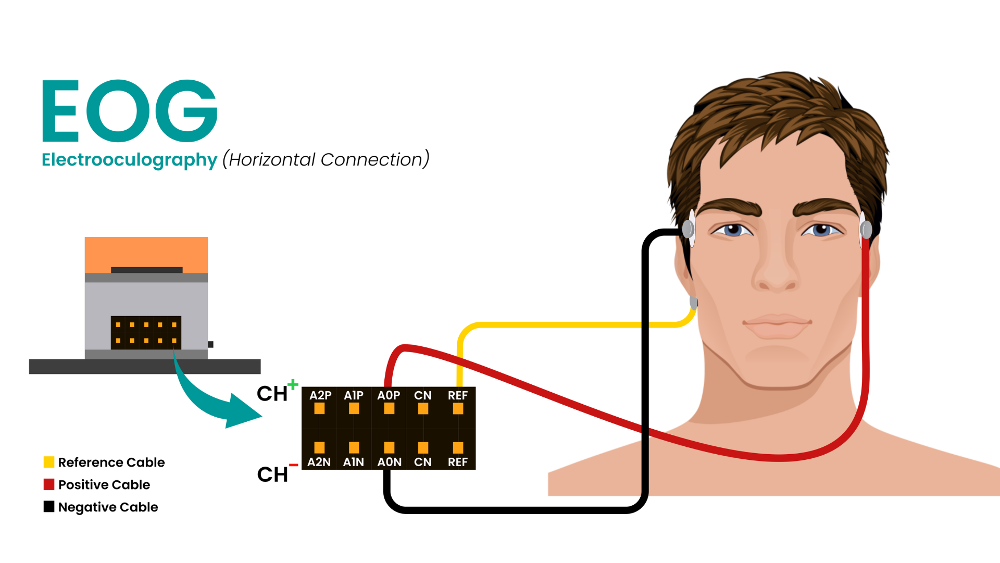

# NPG Lite Wheelchair-Simulator Firmware

A simple open-source firmware for **Neuro PlayGround Lite (NPG Lite)** by Upside Down Labs. This project lets you control a computer (or game) using your **eye movements** and **jaw clenches**—no hands needed!

---

## 🧠 What Does It Do?
- Reads bio-potential signals from your face (eyes and jaw) using a single analog input (A0) on Neuro Playground Lite
- Detects **left/right eye movement** and **jaw clench** (single/double)
- Sends keypresses (a/d/w/s) over Bluetooth as a BLE keyboard
- Shows BLE connection status with onboard NeoPixel LEDs

---

## 🛠️ Hardware Requirements
- **NPG Lite(Any pack)**
- **USB-C cable** 
- **3 Gel Electrodes** 

---

## 🖥️ Software Requirements
- Arduino IDE (with ESP32 3.2.0 board version installed)
- Required libraries:
  - `BleCombo` (for BLE HID keyboard)
  - `Adafruit_NeoPixel` (for LEDs)
- This firmware file: `Wheelchair-Sim.ino`

---

## 🎛️ Electrode Placement
Add the following image to your project folder:
- `electrode-placement.png`

**Typical placement:**
- **Eye (EOG):** 2 electrodes near the outer corners of the eyes (horizontal)
- **Reference:** On the earlobe or forehead

---

## 🎮 Controls & Key Mapping
| Action                | Key Sent | How to Trigger                |
|-----------------------|----------|-------------------------------|
| Look Left (EOG)       | `a`      | Move eyes left (hold 200ms)   |
| Look Right (EOG)      | `d`      | Move eyes right (hold 200ms)  |
| Jaw Clench (single)   | `w`      | Clench jaw (hold, repeat)     |
| Jaw Clench (double)   | `s`      | Double clench (within 500ms)  |

- **All keys are configurable** at the top of the code (`#define EOG_LEFT_KEY`, etc.)
- **NeoPixel LED 0:**
  - Green = BLE connected
  - Red = BLE disconnected

---

## 🧪 Debug Mode
- Set `#define DEBUG_LEVEL` at the top of the code:
  - `0` = Off (default)
  - `1` = Jaw debug (prints jaw envelope)
  - `2` = Eye debug (prints eye deviation)
- Debug output appears on Serial Monitor (115200 baud)

---

## ⚙️ Adjustable Parameters
You can tune these in the code to fit your needs:

| Name                    | Purpose                        | Default |
|-------------------------|--------------------------------|---------|
| `EYE_MOVEMENT_THRESHOLD`| Eye movement detection         | 150.0   |
| `JAW_THRESHOLD`         | Jaw clench detection           | 160.0   |
| `JAW_RELEASE_THRESHOLD` | Jaw release detection          | 70.0    |
| `MOVEMENT_DEBOUNCE_MS`  | Eye movement debounce (ms)     | 800     |
| `JAW_DEBOUNCE_MS`       | Jaw clench debounce (ms)       | 270     |
| `JAW_DOUBLE_WINDOW_MS`  | Double clench window (ms)      | 500     |
| `EYE_KEY_HOLD_MS`       | Eye keypress duration (ms)     | 200     |
| `JAW_HOLD_REPEAT_MS`    | Jaw key repeat interval (ms)   | 200     |

- **To change:** Edit the value in the code and re-upload.

---

## 📝 How It Works (Signal Pipeline)
1. **Raw ADC** (A0) sampled at 500 Hz
2. **Notch Filter** removes powerline noise (48–52 Hz)
3. **Eye Path:**
   - High-pass 1 Hz → Low-pass 10 Hz
   - Baseline tracker (rolling mean)
   - Detects left/right movement (compares to baseline)
4. **Jaw Path:**
   - High-pass 70 Hz
   - Envelope detector (rolling abs mean)
   - Detects single/double clench (with debounce)
5. **BLE Keyboard:** Sends keypresses to paired device
6. **NeoPixel LED:** Shows BLE connection status

---

## 🚀 Getting Started
1. Connect electrodes as shown in the image
2. Flash the firmware to your NPG Lite board
3. Pair with your computer/phone via Bluetooth (shows as "NPG Lite GAMING")
4. Open a text editor or game and try the controls!

---

## 📚 More Info
- [Upside Down Labs](https://upsidedownlabs.tech)
- [NPG Lite Documentation](https://github.com/upsidedownlabs/npg-lite)
- [Contact Support](mailto:contact@upsidedownlabs.tech)

---

**Open Source | GPLv3 | (c) 2025 Upside Down Labs**
